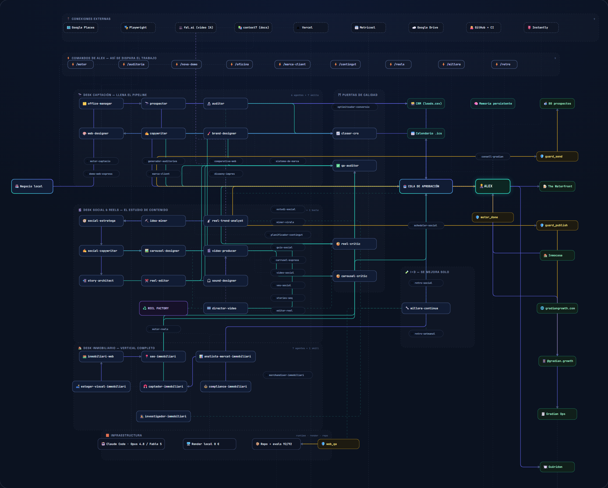
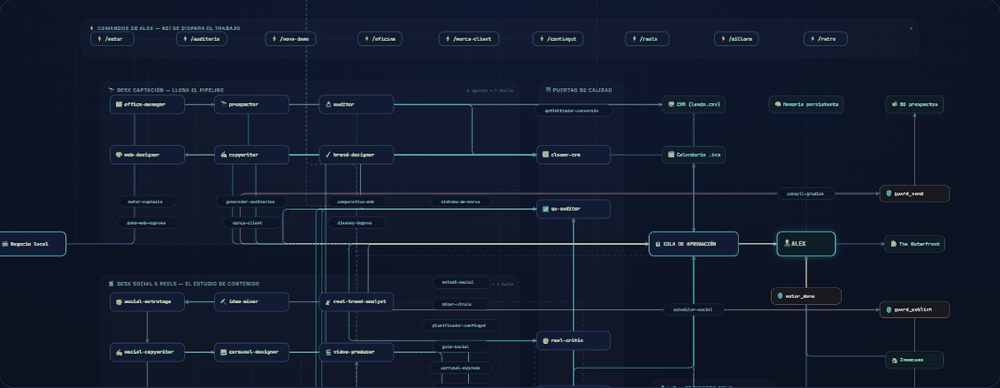

# Gradian — el sistema, por dentro

**Una persona dirigiendo una oficina de 29 agentes de IA** que investiga negocios locales y fabrica su
material de crecimiento — auditorías con la oportunidad en €, webs de demostración con la marca real
del negocio, identidad, contenido para redes (carruseles de marca, reels con voz IA, stories) y, desde
julio de 2026, **automatización de procesos** (línea Gradian Ops) — con una regla no negociable: **nada se envía ni se
publica sin aprobación humana**, garantizado por bloqueos técnicos.

### 🗺️ [Ver el mapa interactivo →](https://arekusumt.github.io/gradian-sistema/)

Zoom, búsqueda, filtros por tipo, ficha de cada nodo y recorridos animados (el viaje de un lead y el de
un reel). También está el **[informe completo en PDF (12 páginas)](./gradian-como-funciona.pdf)**.

Y así se ve **un lead recorriendo el sistema** — de negocio detectado a material enviado, pasando
por agentes, puertas de calidad y la aprobación humana (grabado del propio mapa):

## El sistema en números — 18 días medidos, no estimados

| | |
|---|---|
| Agentes de IA especialistas | **29**, en 3 departamentos (captación · social/reels · inmobiliario) |
| Skills (procedimientos versionados) | **24** |
| Comandos de operación + bloqueos de seguridad | **9** + **4** hooks (`guard_send`, `guard_publish`…) |
| Sesiones de trabajo · llamadas al modelo | **74** · **8.312** |
| Delegaciones entre agentes · usos de herramientas | **232** · **10.542** |
| Tokens procesados | **2.483 M** (96,9 % servidos desde caché) |
| Clientes reales entregados · prospectos preparados | **2** · **80** |
| Coste marginal por pieza producida | **≈ 0 €** (render local: Chrome, ffmpeg, Piper, Whisper) |

Los dos clientes reales: **[The Waterfront](https://waterfrontirishpub.com)** (pub irlandés — su web nueva
ya está **en producción**; cómo se hizo, pieza a pieza:
**[gradian-caso-waterfront](https://github.com/Arekusumt/gradian-caso-waterfront)**) e **Inmocasa**
(inmobiliaria — entregado). El resto de piezas entregadas a ambos se implementa durante julio de 2026.

**I+D sobre sí mismo (10 jul 2026):** el sistema investigó agent teams, orquestación
multi-agente y render de vídeo HTML antes de adoptar nada — con experimentos en vivo,
cifras citadas y dos veredictos de «todavía no». **[La radiografía completa →](docs/rd-agent-teams-swarms.md)**

**Lo último (12 jul 2026): la homepage se convirtió en un mundo scrolleable.** La nueva
portada de [gradiangrowth.com](https://gradiangrowth.com) es un vuelo de cámara continuo por
una oficina-diorama generada con IA (Higgsfield: imagen + vídeo con costuras a frame idéntico),
donde cada isla es un departamento real de este sistema — de un prompt de tres líneas a la web,
con un workflow de 11 agentes, puertas de gasto y QA numérico de costuras.
**[El making-of completo, con los 25 prompts →](docs/scroll-world-making-of.md)**

**Antes (julio 2026): la línea Gradian Ops.** Automatización de los procesos manuales que sangran
tiempo en un negocio (facturas, mensajes, citas), empaquetada como recetas cerradas con mantenimiento
mensual. Primer vertical: **gestorías**, con la factura electrónica obligatoria en España (VeriFactu:
sociedades 1-1-2027, autónomos 1-7-2027) como ventana de entrada — y carril propio en el motor de
captación, con outreach por email que nace **en pausa** hasta el OK humano. Primera radiografía de
operaciones ya entregada a un cliente real con dos oficinas.

## Cómo está construido

- **Runtime:** [Claude Code](https://claude.com/claude-code) (Anthropic) con los modelos Claude como cerebro.
- **Roles estrechos:** el que produce nunca aprueba. Críticos automáticos puntúan cada pieza contra
  rúbricas (umbral 80/100) antes de que llegue a la cola de aprobación humana.
- **Guardarraíles técnicos:** interceptores que bloquean físicamente cualquier envío de email/WhatsApp
  o publicación en redes desde el sistema. La última palabra siempre es de una persona (RGPD desde el diseño).
- **Auto-mejora:** retrospectivas con datos reales + un agente de I+D que audita y corrige el propio
  sistema, con 122 tests de integridad en CI que verifican que nada se rompe.
- **Todo el mapa es un solo fichero HTML** ([`index.html`](./index.html)): SVG generado por datos —
  añadir un nodo nuevo es una línea.

## El ecosistema: los cuatro repos se explican entre sí

| Repo | Qué muestra |
|---|---|
| **gradian-sistema** (estás aquí) | La fábrica: el mapa interactivo, los roles, los guardarraíles y los números medidos. *El sistema.* |
| **[gradian-caso-waterfront](https://github.com/Arekusumt/gradian-caso-waterfront)** | Una pieza terminada de esta fábrica: la web de un pub real, en producción, explicada desde las fotos de la carta hasta el deploy. *El resultado.* |
| **[gradian-match](https://github.com/Arekusumt/gradian-match)** | El mismo patrón (productor ↔ crítico con umbral numérico) aplicado a otro dominio: análisis CV ↔ oferta. *El patrón, transferido.* |
| **[gueridon](https://github.com/Arekusumt/gueridon)** | Un producto propio salido de la fábrica, **[en vivo](https://gueridon.vercel.app)**: la ciencia de la carta de un restaurante + un analizador de menús con núcleo determinista testeado y capa de IA con fallback. Es el lead magnet del carril de hostelería. *El producto.* |

## Quién

Diseñado y dirigido por **Alex** — definió el negocio, los procesos, los roles de cada agente y los
controles de calidad, y usó la propia IA para materializarlos, revisando cada iteración. El repositorio
de producción (privado) contiene los agentes, las skills, los hooks y la CI; este repositorio es el
mapa público del sistema.

[gradiangrowth.com](https://gradiangrowth.com) · alex@gradiangrowth.com

---

### English TL;DR

An interactive map of a **real agentic system**: one person orchestrating a 28-agent AI office
(built on Claude Code) that produces sales-ready growth material for local businesses — audits,
brand-accurate demo websites, identity, social content (carousels, AI-voiced reels, stories), and a new
process-automation line (Gradian Ops: closed "recipes" automating invoices, messages and appointments;
first vertical: accounting firms, ahead of Spain's 2027 mandatory e-invoicing). One client
site is already [live in production](https://waterfrontirishpub.com); the remaining deliverables roll out
during July 2026. The factory also ships its own products:
[Guéridon](https://gueridon.vercel.app), a menu-engineering explainer + analyzer (deterministic core,
agentic shell — [source](https://github.com/Arekusumt/gueridon)). Human-in-the-loop by design: technical
guardrails physically block any autonomous sending or publishing. Built and shipped in 18 days;
every number above is measured from the system's own session logs.
