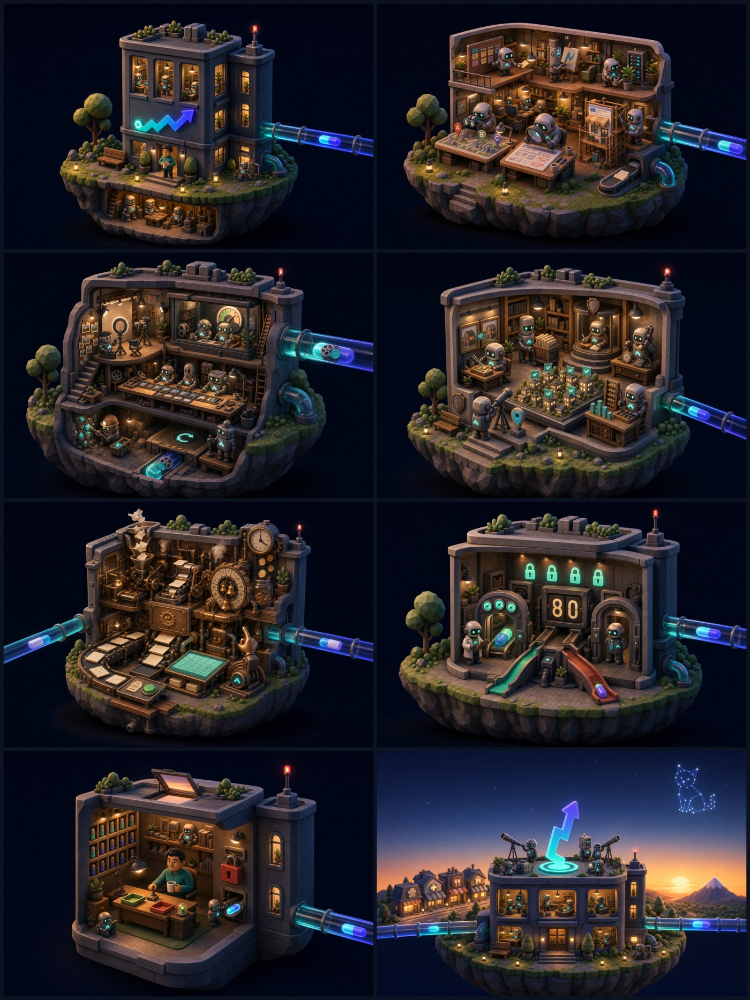
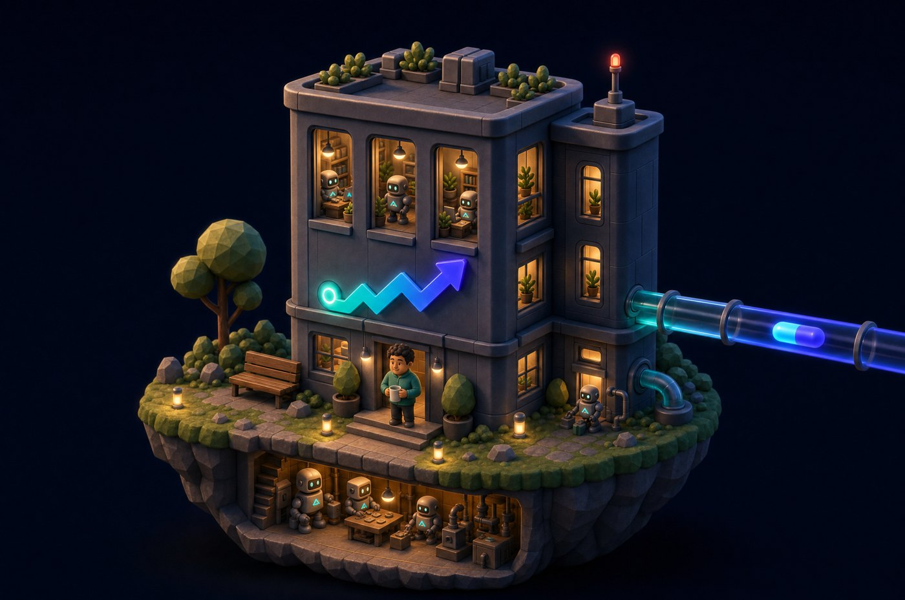
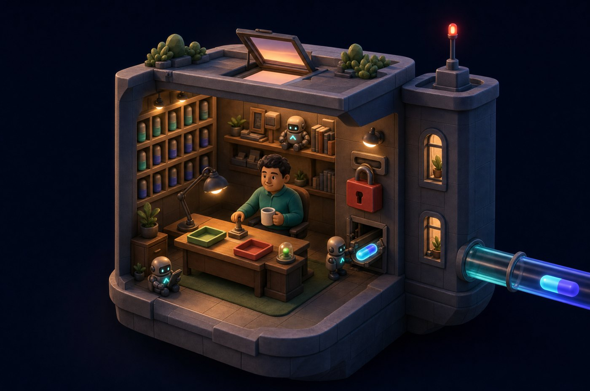
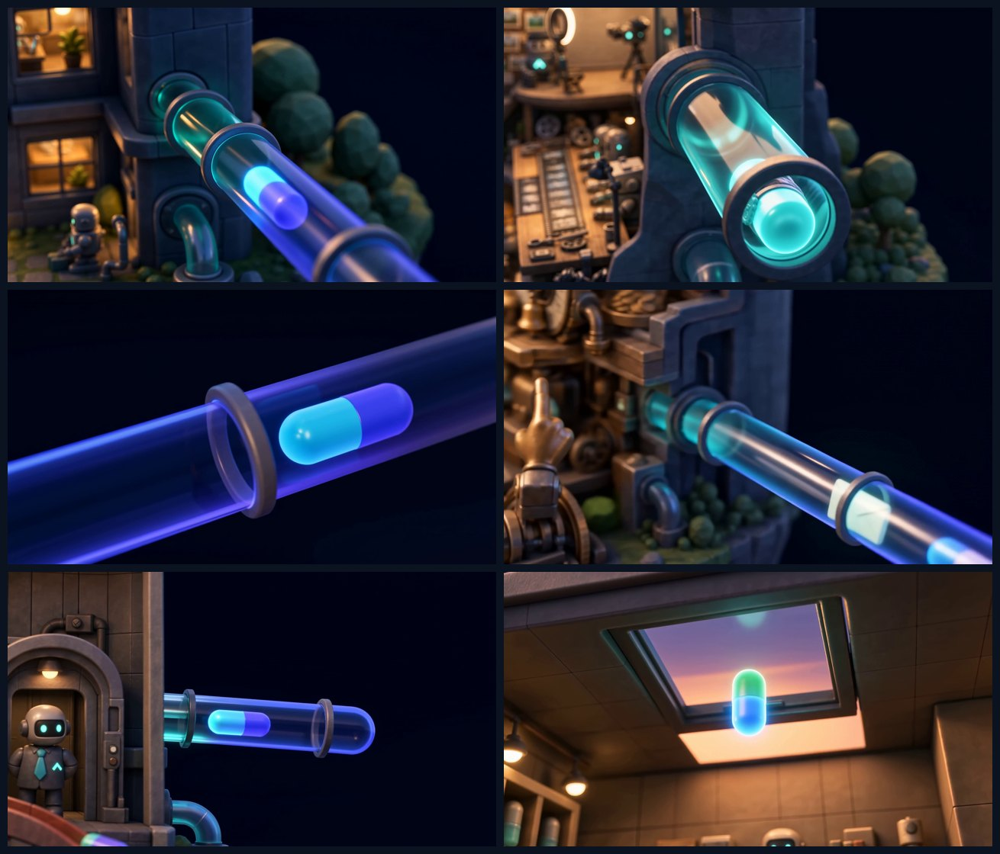
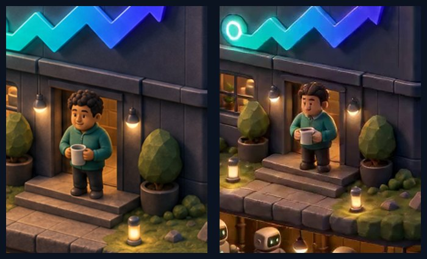

# Scroll world «La oficina de Gradian» — making-of

> Cómo un prompt de tres líneas se convirtió en la nueva homepage de
> [gradiangrowth.com](https://gradiangrowth.com): un vuelo de cámara continuo por una
> oficina-diorama generada con IA, donde cada isla es un departamento real del sistema
> de 29 agentes — y el scroll conduce la cámara. Julio de 2026.

## 1 · El encargo (el prompt inicial, literal)

Todo el proyecto nace de este único prompt del operador (traducido del catalán):

> *«Me gustaría que la página de gradiangrowth fuera un scroll world, solo la versión
> de ordenador ya que muchos móviles no creo que lo soporten. He visto este repositorio
> de github: oso95/scroll-world. La idea sería crear una "oficina de los agentes de
> Gradian" y que el scroll sea por la oficina. Dame ideas y tu consejo — creo que es un
> visual muy atractivo de cara a recruiters.»*

Lo que sigue — investigación, diseño de escenas, 25 prompts de generación, copy en 3
idiomas, ~55 generaciones de IA, integración en Next.js — lo produjo el sistema
multi-agente, con el humano decidiendo en cada puerta de gasto y de gusto.

## 2 · Qué es un «scroll world»

No es 3D en tiempo real. Es la técnica de las páginas de producto de Apple: **vídeo
pre-renderizado scrubado por scroll**. La posición de scroll no dispara animaciones —
*es* el tiempo del vídeo. La cadena: una imagen fija por escena → un clip de cámara que
«se zambulle» en cada escena → clips conectores que unen escenas consecutivas → un motor
JS que reproduce toda la cadena como un solo vuelo sin cortes.

La base es la skill MIT [scroll-world](https://github.com/oso95/scroll-world), adoptada
como procedimiento versionado del sistema e instrumentada con sus reglas de costura.

## 3 · Diseño con un workflow de 11 agentes (antes de gastar un céntimo)

Antes de generar nada, un workflow orquestado deterministamente refinó el concepto:

| Fase | Agentes | Qué hicieron |
|---|---|---|
| Recon | 4 en paralelo | Mapa real de departamentos/agentes · oferta y precios reales de la línea Ops · restricciones del código web (líneas concretas) · pipeline scroll-world completa (ficheros raw del repo) |
| Diseño | 3 en paralelo | Tres secuencias de escenas independientes con «lentes» distintas: recruiter, cliente/CRO, narrativa cinematográfica |
| Juicio | 1 juez | Rúbrica de 6 criterios; ganó la lente cliente/CRO (85/100) con injertos de las otras dos |
| Verificación | 3 skeptics adversarios | Producción, web y conversión — cada uno intentando romper la secuencia ganadora |

Los skeptics pagaron su coste antes de gastar créditos:

- **Producción:** 3 conectores eran físicamente ingenerables (la cámara atravesaba
  paredes) → interiores re-diseñados como *cutaway* de diorama (pared frontal fuera) y
  conectores reescritos. Presupuesto real: ~51 generaciones, no «23 y una tarde».
- **Web:** un bug real de scroll-snap con elementos ocultos (fix de 1 línea), tema claro
  ilegible sobre vídeo oscuro (fix de 1 atributo `data-theme`), presupuesto duro de peso
  (< 6 MB/clip, < 60 MB el mundo).
- **CRO:** el embudo estaba a medias (~64/100 estructural) → hero beneficio-primero,
  todos los CTA alineados con el imán real («auditoría gratis»), CTAs en los picos de
  convicción, botón «salta la visita» y regla de reversión escrita (si la conversión
  desktop cae >20 % en 30 días, kill-switch).

## 4 · Las 8 escenas

Una cápsula de trabajo luminosa viaja por tubos neumáticos entre islas-diorama, de noche
al alba: **fachada** (el edificio, el único humano en la puerta) → **desk Captación** →
**Reel Factory** (con los dos críticos y el dial clavado en 80) → **desk Inmobiliario** →
**taller Gradian Ops** (la máquina de facturas con bandeja de borradores) → **la aduana
de calidad** (el marcador «80» con tobogán de rechazo — el único número cocido en píxeles
de todo el mundo) → **el despacho de aprobación** («aquí nada se envía solo»: el candado
de `guard_send`, la cola, el humano) → **la azotea al alba** con el CTA doble
(cliente → auditoría gratis · recruiter → este GitHub).

Los 25 prompts finales (8 stills + 8 dives + 7 conectores + 2 de la marca), tal cual se
enviaron al modelo: [`scroll-world-prompts/`](./scroll-world-prompts/). Los 8 stills
comparten un *style preamble* **idéntico byte a byte** (verificado por hash) — es lo que
hace que ocho generaciones independientes parezcan un solo mundo.

## 5 · La conexión con Higgsfield (generación de imagen y vídeo)

Todo se genera desde terminal con el **CLI de Higgsfield** (`hf`), orquestado por el
sistema en tandas detached con polling:

- **Stills:** `gpt_image_2` (2K, 3:2). La escena 1 se aprueba primero y las demás la
  reciben como `--image` de referencia (ancla de estilo).
- **Vídeo:** `seedance_2_0` (1080p, 8 s los dives, 5 s los conectores), con previz barata
  de toda la cadena en `seedance_2_0_mini` antes de gastar en el modelo grande.
  `kling3_0` queda como fallback sancionado para falsos positivos del filtro de contenido.
- **La regla que lo hace posible — costuras a frame idéntico:** cada conector se genera
  con `--start-image` = el ÚLTIMO frame real del dive anterior y `--end-image` = el
  PRIMER frame real del dive siguiente, extraídos con ffmpeg del vídeo renderizado
  (nunca del still original). Así cada costura es idéntica por ambos lados y el vuelo no
  «salta».
- **QA numérico de costuras:** diferencia RMS entre los frames de ambos lados de cada
  costura; umbral < 25 sobre 255. Las 7 costuras del mundo final pasaron.

Gotchas reales que el sistema absorbió solo: los falsos positivos NSFW del filtro de
Seedance (~15 % de los clips; se resuelven re-rolleando — todos pasaron al 2.º intento),
el *race* de créditos al lanzar >5 generaciones concurrentes, y que el tier de previz
no conserva caras a escala pequeña (el modelo grande sí — verificado con un A/B antes
del render final).

## 6 · Un extra: la marca en 3D

Aprovechando el acceso, el símbolo de Gradian (chevron ascendente a 48° naciendo de un
anillo de origen) se re-renderizó como pieza 3D de marca — vidrio y neón sobre el fondo
de la casa:

## 7 · Integración en la web (Next.js 16)

- El motor de scrub (vanilla JS, MIT) se vendorizó con parches para React: `destroy()`
  para desmontaje limpio, guard de re-mount del CSS, evento de escena para analítica y
  fade del chrome al salir del mundo hacia el footer.
- **Gating estricto:** el mundo solo se monta en desktop con puntero fino y sin
  `prefers-reduced-motion` — una sola media query con `useSyncExternalStore`. El móvil
  sigue recibiendo la home clásica server-rendered (ni un byte de vídeo).
- **SEO y accesibilidad:** la home clásica queda en el DOM (indexación mobile-first
  intacta); con el mundo activo se oculta con `hidden` + `inert` para que teclado y
  lectores de pantalla no encuentren contenido duplicado.
- **Overlays en 3 idiomas** (ca/es/en) por configuración — el vídeo es neutro de idioma;
  el único número cocido en píxeles es el «80» de la aduana. El copy pasó la puerta CRO
  interna con 85/100 (umbral 80).
- **Peso:** capa de scrub a 720p, GOP 4, < 6 MB por clip; carga lazy por blob con
  prefetch de escena N±1.
- **Reversibilidad:** kill-switch por variable de entorno y eventos de analítica por
  escena para medir el embudo real contra la home anterior.

## 8 · Quién intervino

| Actor | Papel |
|---|---|
| El operador (humano) | El prompt inicial, las puertas de gasto, el OK estético de cada hito y la palabra final |
| Sesión principal (Claude Code) | Orquestación, pipeline Higgsfield, integración web, QA, esta documentación |
| Workflow ultracode (11 agentes) | Recon ×4 · diseños con lentes ×3 · juez · skeptics ×3 |
| 2 agentes de preproducción | Los 25 prompts de generación · el copy trilingüe |
| `closer-cro` | La puerta de conversión del copy (85/100, umbral 80) |
| Higgsfield CLI | `gpt_image_2` · `seedance_2_0` / `mini` · (`kling3_0` de reserva) |
| ffmpeg | Extracción de frames de costura · encode de scrub · QA |

**Cifras del proyecto:** 8 escenas · 23 clips finales · ~55 generaciones en total
(re-rolls y previz incluidos) · ~2 días de reloj desde el prompt inicial · coste
marginal de la integración web: 0 € (todo local).

---

*Parte del sistema documentado en este repo: [el mapa interactivo](https://arekusumt.github.io/gradian-sistema/)
· [cómo funciona todo el sistema (PDF)](../gradian-como-funciona.pdf).*
